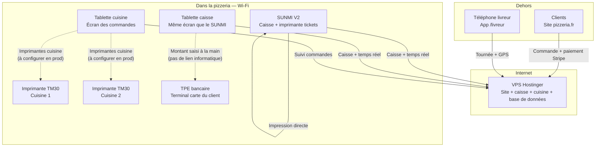

# Comment tout communique — La Z Pizza / RestaurantOS

**Document client** — à conserver pour expliquer le fonctionnement du système une fois déployé sur le VPS.

---

## Principe en une phrase

**Tous les écrans et l’application livreur se connectent à Internet (Wi‑Fi ou 4G) et parlent au même serveur sur le VPS.**  
Il n’y a pas de « ordinateur serveur » dans la pizzeria : tout est centralisé en ligne, sécurisé (HTTPS).

---

## Schéma global

---

## Qui fait quoi ?

| Matériel | Comment il accède au système | Rôle |
|----------|------------------------------|------|
| **Site clients** (`pizzeria.fr`) | Internet, téléphone ou PC | Menu, commande en ligne, paiement **Stripe** |
| **SUNMI V2** | Application dédiée → caisse en ligne | Prise de commande comptoir, **impression tickets** sur l’imprimante du SUNMI |
| **Tablette caisse** | Navigateur → même page caisse | Même usage que le SUNMI (sans imprimante intégrée) |
| **Tablette cuisine (KDS)** | Navigateur → écran cuisine | Affiche les commandes en **temps réel**, changement de statuts |
| **Imprimantes TM30** | Réseau Wi‑Fi local (IP) | Tickets cuisine — **branchement prévu en production** avec le matériel sur place |
| **App livreur** | Navigateur sur téléphone (`/livreur`) | Tournée, GPS, code client, validation livraison |
| **TPE bancaire** | **Aucune connexion à l’app** | Le client paie sa carte sur le TPE ; l’employé déclare « carte » ou « espèces » dans la caisse |
| **Back-office gérant** | PC → administration | Menu, horaires, stats, historique |

---

## Comment une commande circule

1. **Commande créée** (site, caisse SUNMI ou tablette) → enregistrée sur le **serveur VPS**.
2. Le serveur envoie une **notification instantanée** à tous les écrans connectés (cuisine, caisse, admin).
3. **Cuisine (KDS)** : la commande apparaît, l’équipe fait avancer les statuts (en préparation → prête → etc.).
4. **SUNMI** : pour les commandes confirmées, **impression automatique** du ticket cuisine (et reçu client avec QR de suivi si configuré).
5. **Client en ligne** : peut suivre sa commande sur `pizzeria.fr/suivi/...`.
6. **Livreur** : voit sa tournée, valide avec le **code à 4 chiffres** du client.

**Important :** le SUNMI, la tablette cuisine et la tablette caisse **ne se parlent pas entre eux directement**. Tout passe par le serveur sur le VPS — comme un « chef d’orchestre » central.

---

## Réseau dans la pizzeria

| Situation | Comportement |
|-----------|--------------|
| **Wi‑Fi box OK** | Tous les appareils accèdent au VPS via le Wi‑Fi de la boutique. |
| **Wi‑Fi coupé sur le SUNMI** | Le SUNMI peut passer en **4G** (SIM) et continuer à synchroniser avec le VPS. |
| **Coupure Internet** | Mode dégradé caisse : commandes **enregistrées localement** sur le SUNMI, synchronisation au retour du réseau (sans recharger la page). |
| **Imprimantes TM30** | Restent sur le **réseau local** ; un équipement (tablette cuisine ou autre) leur enverra les tickets — configuration à la mise en production. |

---

## Paiements — ce qui est connecté ou non

| Type de paiement | Connecté à l’app ? |
|------------------|-------------------|
| **Carte en ligne** (site) | Oui — **Stripe** (sécurisé, automatique) |
| **Carte au comptoir** | Non — TPE **physique à part** ; saisie manuelle du mode « carte » dans la caisse |
| **Espèces au comptoir** | Déclaration dans la caisse uniquement |

*Conformément au cahier des charges V1 : pas d’intégration protocolaire avec le TPE bancaire.*

---

## Adresses utilisées en production (exemple)

| Usage | Adresse |
|-------|---------|
| Site public + commande + suivi + livreur | `https://pizzeria.fr` |
| Caisse, cuisine, administration | `https://app.pizzeria.fr` |
| API (invisible pour l’utilisateur) | `https://api.pizzeria.fr` |

Toutes ces adresses pointent vers le **même VPS**, protégées par certificat HTTPS (cadenas).

---

## Ce qui sera testé avec le vrai matériel

Lors du passage en production sur le VPS :

- [ ] SUNMI V2 : caisse, impression, son nouvelle commande
- [ ] Tablette cuisine : affichage temps réel
- [ ] Tablette caisse en binôme avec le SUNMI
- [ ] Imprimantes TM30 cuisine (IP réseau)
- [ ] Téléphone livreur (GPS en HTTPS)
- [ ] TPE : encaissement manuel + déclaration dans la caisse

---

## Résumé pour le client

> **Une seule application en ligne sur un serveur sécurisé.**  
> Chaque appareil (SUNMI, tablettes, téléphone livreur, site client) y accède via Internet.  
> Le TPE reste indépendant ; les imprimantes cuisine seront raccordées au réseau Wi‑Fi de la pizzeria lors de la mise en service.

---

*Document généré pour RestaurantOS / La Z Pizza — juillet 2026*  
*Référence technique : `cahier-des-charges-pizzeria-v2.md`, `deploy/README.md`*
